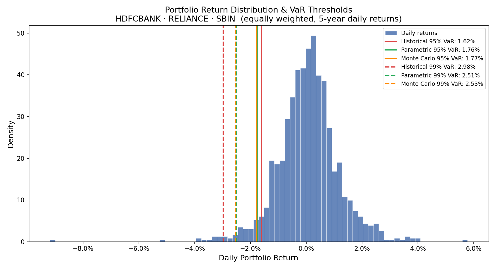

# Value at Risk (VaR) Calculator

A Python implementation of three Value at Risk methodologies applied to an equally-weighted Indian equity portfolio (HDFC Bank, Reliance Industries, SBI) using 5 years of live NSE market data.

---

## Methods Implemented

| Method                               | Assumption                       | Best For                             |
| ------------------------------------ | -------------------------------- | ------------------------------------ |
| **Historical Simulation**            | Past returns repeat              | Capturing real tail events (crashes) |
| **Parametric (Variance-Covariance)** | Returns are normally distributed | Fast, analytical estimate            |
| **Monte Carlo**                      | Returns drawn from N(µ, σ²)      | Non-linear portfolios, extensions    |

---

## Sample Output

```
           Historical  Parametric  Monte Carlo
Confidence
95%             1.62%       1.76%        1.77%
99%             2.98%       2.51%        2.53%
```

**Key insight:** The ranking flips between 95% and 99% confidence direct evidence of fat tails in NSE returns. At extreme confidence levels, Historical VaR exceeds Parametric because real market crashes (e.g., COVID-19 2020) push the left tail further than the normal distribution predicts.



---

## Project Structure

```
├── 1_data_fetching.py               # Download NSE data, compute daily returns → returns.csv
├── 2_historical_var.py              # Historical Simulation VaR
├── 3_parametric_var.py              # Parametric (Normal) VaR
├── 4_monte_carlo_var.py             # Monte Carlo VaR (100k simulations)
└── 5_visualization_and_comparison.py  # Overlay chart + comparison table
```

---

## Setup & Usage

```bash
pip install yfinance pandas numpy scipy matplotlib
```

```bash
python 1_data_fetching.py                 # Fetch data (run once)
python 5_visualization_and_comparison.py  # Full comparison + chart
```

Scripts 2–4 can also be run independently for isolated output.

---

## Portfolio

| Stock               | Exchange | Weight |
| ------------------- | -------- | ------ |
| HDFC Bank           | NSE      | 33.3%  |
| Reliance Industries | NSE      | 33.3%  |
| State Bank of India | NSE      | 33.3%  |

Data sourced via `yfinance` using NSE tickers (`.NS` suffix). Lookback window: **5 years** of daily closing prices.

---

## Limitations & Extensions

- VaR does not describe _how bad_ losses beyond the threshold can get — **CVaR/Expected Shortfall** is the natural extension
- Parametric method underestimates tail risk when returns are leptokurtic (fat-tailed)
- Monte Carlo can be extended to correlated multi-asset paths and non-linear instruments (options)
- **Backtesting** (counting VaR breaches vs. expected ~5% of days) would validate model accuracy
